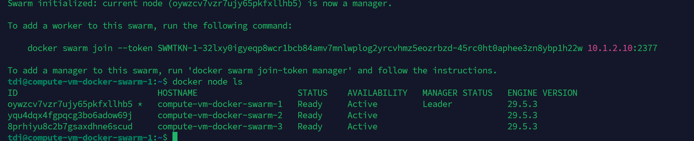
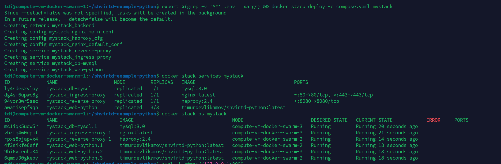

# Домашнее задание к занятию 6. «Оркестрация кластером Docker контейнеров на примере Docker Swarm»

#### Это задание для самостоятельной отработки навыков и не предполагает обратной связи от преподавателя. Его выполнение не влияет на завершение модуля. Но мы рекомендуем его выполнить, чтобы закрепить полученные знания. Все вопросы, возникающие в процессе выполнения заданий, пишите в раздел "Вопросы по заданиям" в личном кабинете.

---

## Важно

**Перед началом работы над заданием изучите [Инструкцию по экономии облачных ресурсов](https://github.com/netology-code/devops-materials/blob/master/cloudwork.MD).**
Перед отправкой работы на проверку удаляйте неиспользуемые ресурсы.
Это нужно, чтобы не расходовать средства, полученные в результате использования промокода.
Подробные рекомендации [здесь](https://github.com/netology-code/virt-homeworks/blob/virt-11/r/README.md).

[Ссылки для установки открытого ПО](https://github.com/netology-code/devops-materials/blob/master/README.md).

---

## Задача 1

Создайте ваш первый Docker Swarm-кластер в Яндекс Облаке.
Документация swarm: https://docs.docker.com/engine/reference/commandline/swarm_init/
1. Создайте 3 облачные виртуальные машины в одной сети.
2. Установите docker на каждую ВМ.
3. Создайте swarm-кластер из 1 мастера и 2-х рабочих нод.

4. Проверьте список нод командой:
```
docker node ls
```
## Решение к Задаче 1


## Задача 2 (*) (необязательное задание *).
1.  Задеплойте ваш python-fork из предыдущего ДЗ(05-virt-04-docker-in-practice) в получившийся кластер.
2. Удалите стенд.

## Решение к Задаче 2
С выполнением задачи возникли проблемы. Получилось запустить контейнеры в Docker Swarm, что можно видеть на скриншоте, 
для этого пришлось слить содержимое proxy.yaml в общий compose.yaml, так как Docker Swarm не умеет делать include 
видимо так docker engine более древний используется, также ряд других доработок чтобы это всё завелось, но по факту это 
не работающий функционально проект. Чтобы его запустить, похоже что придёться перелопатить код, в общем я могу добить эту
тему, но боюсь потребуется больше времени, а у меня там ещё Terraform висит неначатый.


## Задача 3 (*)

Если вы уже знакомы с terraform и ansible  - повторите практику по примеру лекции "Развертывание стека микросервисов в Docker Swarm кластере". Попробуйте улучшить пайплайн, запустив ansible через terraform с динамическим инвентарем.

Проверьте доступность grafana.

Иначе вернитесь к выполнению задания после прохождения модулей "terraform" и "ansible".

